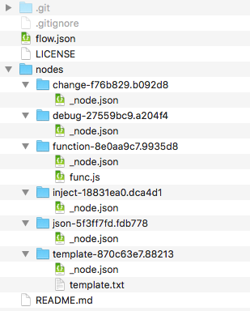

# node-red-flow-json-division

## Feature

* Divide JSON in the clipboard and output it in a file.
* for git-repository.

## Description

```
flowjsondiv -c [Output filename] [Output directory]
```

## Install (As a command)

```
git clone https://github.com/high-u/node-red-flow-json-division.git
cd node-red-flow-json-division
sudo npm install -g
```

## Usage (As a command)

```
flowjsondiv -c flow.json ${HOME}/node-red/flow
```

## Usage (No Install)

```
git clone https://github.com/high-u/node-red-flow-json-division.git
cd node-red-flow-json-division
./flowjsondiv -c flow.json ${HOME}/node-red/flow
```

## Result

- Flow
  - 

- Directory
  - 

## OS Support (Plan for the future)

* Mac
* Windows
* Linux
