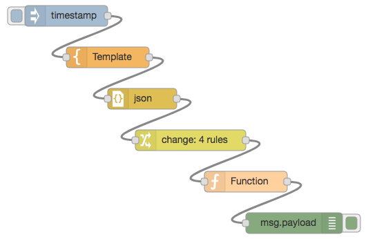

# node-red-flow-json-division

## Released

|Date|Version|Description|
|:--:|:-----:|:----------|
|2017-09-17|0.5.2|Supported Windows and add added `check` parameter.|

## Feature

* Manage Node-RED's JSON with git.
* Divide JSON in the clipboard and output it in a file.
* Divide by node.
* `flow.json` has the clipboard as it is.
* for git-repository.
* Supported
  * Mac
  * Windows

## Description

* Output JSON.

```
flowjsondiv [Output directory]
```

* Check Clipboard.

```
flowjsondiv check
```

## Install (As a command)

```
npm install -g node-red-flow-json-division
```

## Usage (As a command)

* Mac

```
flowjsondiv ${HOME}/node-red/flow

flowjsondiv check
```

* Windows

```
flowjsondiv %HOMEPATH%¥node-red¥flow

flowjsondiv check
```

## Usage (No Install)

```
git clone https://github.com/high-u/node-red-flow-json-division.git
cd node-red-flow-json-division
./flowjsondiv ${HOME}/node-red/flow
```

## Result

- Flow
  - 

- Directory
  - 

## OS Support (Plan for the future)

* Mac
* Windows
* ~~Linux~~

